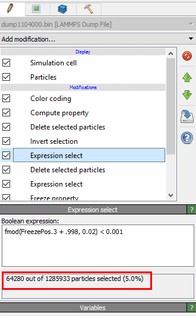

# dinopreprocess
Preprocessing scripts for dino track viewer.

To use, put your dataset exported from Ovito into the root directory of this named dataset.lammps (symlinks are handy: `ln -s /path/to/your/file dataset.lammps`) then type make. Currently on CCV you need to pause partway through and switch python modules (2 is needed for clusters and tris due to using scipy, 3 is needed for the other 2 parts).

Module requirements are (I believe) only python and scikit-learn.

(Note that you need to edit the produced dataset.feet file to have the first line point to where your foot files are located relative to the program launch directory.)

# Exporting from Ovito

So how do you go from new data to an exported file the makefile above can use? Read on!

Your data should come as a series of .bin files in a folder (unless Peter changes the way he's doing things/someone else uses this). First fire up Ovito and go to the load screen. If you don't have Ovito you can download it at https://ovito.org/. If you are on the Brown CCV system you need to run `module load ovito/2.6.2` and `module load nvidia-driver/310.32`, though I've found Ovito to feel buggy sometimes there.

Select the appropriate column mapping for this export. Whoever gave you the data should be able to give you a good idea of what to choose for this, or the following image is a good starting guess.

Now you should be able to see your data in Ovito. You can also select the data in the modification pipeline on the right of the screen to see info about how Ovito sees it (as below).

If you click on "Add Modification" you will get a screen with a list of all the modifications Ovito supports. There are a lot. I've pointed in red to the few I use for this and blue to the ones that are occasionally useful.

The way Ovito works is to have a pipeline of these modifications acting from the bottom to the top on the data.

The first modification to do is a 'Freeze Property'. This stores the value of a property (in our case position) at a given frame (in our case the first) and allows you to access it in other frames. We use this for our layers. Press the 'Take new snapshot' button to take the snapshot (be sure frame 0 is loaded!)

Now we want to select the particles we will keep. The way we have been doing this is to select layers of constant z. One way of doing so is shown below.

`fmod(FreezePos.3 + 1, 0.02) < 0.001`

Fmod does a floating point remainder operation. This allows us to easily find a number of evenly spaced layers. I add one because the datasets tend to be centered around 0 and wind up with a double thickness layer at 0 due to Ovito's implementation of fmod. 0.02 is simply a convenient value to start at as it frequently gives 3-5 layers (I tend to aim for 4). The last number is the thickness of the slice and can be varied at your leisure.

Notice how this selection starts a fair bit below the top. You can adjust the +1 (or add another small factor since to go up is negative) as seen below.

Now we want to delete the particles that aren't selected. To do this we add two items to the modification pipeline. First an 'Invert Selection' and then a 'Delete Selected Particles'.

The reason I choose to select the ones I keep and then invert is so that I can easily see the number of particles being selected (pointed out better in a while).

Now we get into the most subjective part. Trimming the dataset to minimize the particles on the edge that are uninteresting.

To start we use the 'Compute Property' modification. This allows us to add a property to the particle based on existing properties. In this case we want to compute the distance a particle is from it's starting position. (I cheat and frequently use Manhattan distance of even just `abs(FreezePos.3 - Position.Z)` since it's just informative.)

We then add a 'Color Coding' modification. This lets us choose a value and color particles by it. Choose 'Distance' or whatever you named your distance property. It will show a color gradient on the image as below. You may need to click 'Adjust Range' to make it match the range.

Well this isn't helpful. It looks like some particles moved a ton and are screwing up the color scheme and making it difficult for us to tell what's going on. Setting a lower value for the 'End Value' fixes this.

Now that we can see which particles didn't move much, we want to select and delete them. Do this by simple comparison with your freezed position. I usually start at 0, see how it looks (awful), then adjust by trial and error until it's about right.

In this case I wound up with `FreezePos.1 > 0.06 || FreezePos.2 > 0.11`. Usually this has 4 statements instead of 2, but it was fairly tight on the other ends.

When you're happy with the selection I move the trimming expression select down near the bottom of the pipeline so it happens first, then add a 'Delete Selected Particles'. I do this so I can get an accurate count of particles later. 

Look back at your first expression select. In the bottom is a number of particles selected. This is a helpful number to know how well your animation will run. (I usually aim for between 50k and 200k particles, but it can certainly run with more.)

Good ways to reduce the number of particles include having fewer layers, reducing layer size, and trimming the outside tighter.

If that's not enough, another way you can trim is to subsample within the particles. Ideally you want this to be random, but random is hard. I simulate random by doing things with the `ParticleIdentifier` and make poor attempts at creating my own PRNG with this. My goto now is to take `sin(ParticleIdentifer * A + B) > x` where `A` and `B` are large numbers pulled from my head  and `x` is a threshold value (0 samples half, higher takes less). This seems to approximate random particle selection. (Peter also claims that the IDs are basically random so just using them should be fine. He's probably right but I didn't know that when I started doing this.)

Notice how now there are half as many particles as before. (It wasn't really necessary for this dataset though.)

Now to write the file! Go back to the file menu and choose export.

You want to save as type 'LAMMPS Dump File'. Give it a name of your choosing. Conventions are good here. I advise using the same names the scientists you're working with do, perhaps adding properties of your export (# particles, #/location of layers, subsample rate, if you only export some of the frames).

The export settings screen should come up now. You want to export as a sequence (usually every 1 frame, occasionally less) with a single file destination.

The properties that should be written are ParticleIdentifier and Position.

Now just press OK and then go get a cup of coffee or sleep for a night or something. It frequently takes a while to run (mostly spent loading new files as far as I can tell). Once it's done you can go run the Makefile to finish processing as detailed above (and then go get another coffee).
